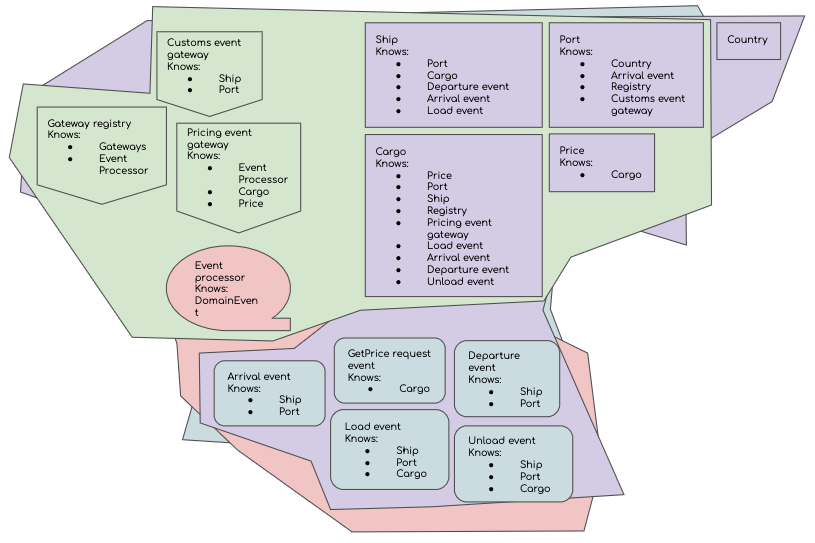
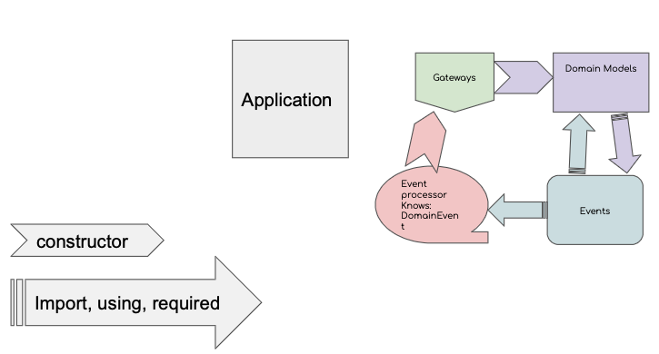

# Shipping Domain Event Sourcing

I'm investigating software coupling. And, since I'm also interested in [Event Sourcing](https://www.martinfowler.com/eaaDev/EventSourcing.html), I'm using it as the mechanism for my analysis.

